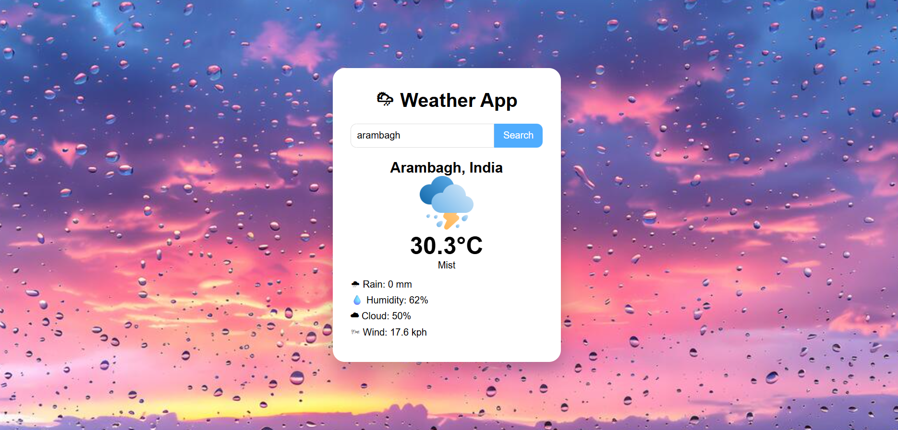

 🌦 Weather App

A simple **Weather Application** built using **HTML, CSS, and JavaScript** that shows real-time weather information for any city using the **WeatherAPI**.

---

 🚀 Features

* 🔍 Search weather by city name
* 🌡 Shows current temperature
* ☁ Displays weather condition
* 💧 Shows humidity level
* 🌧 Shows rain data
* 🌬 Shows wind speed
* 🎨 Clean and responsive UI
* 🖼 Custom background image

---

🛠 Technologies Used

* **HTML5**
* **CSS3**
* **JavaScript**
* **WeatherAPI**

---
 📂 Project Structure

```
Weather-App
│
├── index.html
├── background.png
├── cloud.png
└── README.md
```

---

 ⚙️ How to Run the Project

1. Download or clone the repository

```
git clone https://github.com/your-username/weather-app.git
```

2. Open the project folder

3. Open **index.html** in your browser

4. Enter a city name and click **Search**

---

 🔑 API Used

This project uses the **WeatherAPI**.

Website:
https://www.weatherapi.com/

---
 📸 Screenshot


#👨‍💻 Author

saheli chowdhury


